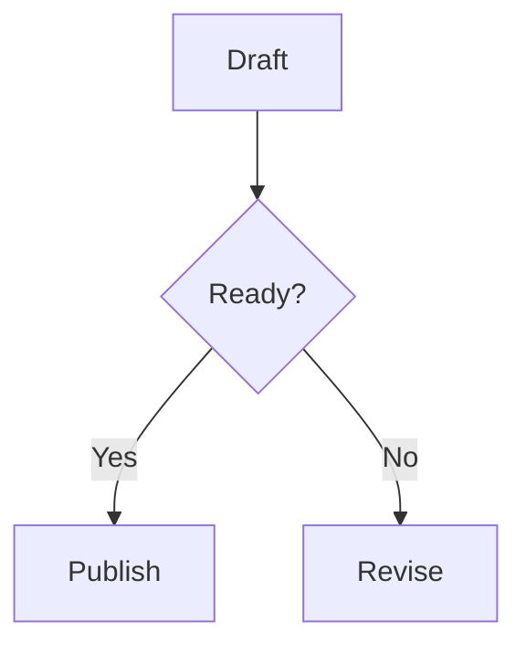

# AI Authoring Cookbook

This document provides short recipes for common AI-assisted tasks in the Enari Markdown CMS. Rules live in `AGENTS.md`; this file shows practical patterns.

## 1. Create a Bilingual Overview Page

Use this when a directory should have a DE and EN entry page with localized folder names.

German page:

```md
---
translation_key: worldbuilding.languages.overview
---

# Sprachen

This overview introduces the language area and links to key subtopics.
```

English page:

```md
---
translation_key: worldbuilding.languages.overview
---

# Languages

This overview introduces the language area and links to key subtopics.
```

Checklist:

- place each page in the correct locale tree
- use the localized overview filename for that locale
- reuse the same `translation_key`
- keep links relative inside each locale tree
- run `php scripts/validate-content.php`

## 2. Create a Locale-Local Note

Use this when a page should exist only in one locale.

```md
---
title: Research Note
---

# Research Note

This page is intentionally locale-local and does not participate in translation mapping.
```

Checklist:

- omit `translation_key`
- do not register it as a translated standalone page
- keep its links and references local to the locale tree
- run `php scripts/validate-content.php`

## 3. Add a New Type

Example shape in `config/schema/types.yaml`:

```yaml
  - id: culture-group
    label: Culture Group
    icon: archive
    color: "#6fd0c8"
    description: Shared cultural identity profiles.
    template: entity-default
    groups:
      - culture
      - society
    fields:
      homeland:
        type: reference
        label: Homeland
        group: identity
      core_values:
        type: tags
        label: Core Values
        group: society
```

Checklist:

- confirm no existing type already fits
- use stable lowercase IDs
- choose a reusable field model
- reuse an existing type template unless the rendering concept is truly different
- run `php scripts/release-check.php --strict`

## 4. Add a New Relation

Example shape in `config/schema/relations.yaml`:

```yaml
  - id: allied_with
    label: Allied With
    inverse_label: Allied With
    from_types:
      - institution
    to_types:
      - institution
    cardinality: many-to-many
    color: "#9fd4ff"
    style: dashed
```

Checklist:

- confirm relation semantics are not already covered
- set direction and endpoint types intentionally
- choose cardinality for the model, not just one page
- run `php scripts/release-check.php --strict`

## 5. Add a Standalone Service Page

Markdown page:

```md
---
translation_key: service.accessibility
---

# Accessibility

This page describes accessibility commitments for the site.
```

Config registration pattern in `cms/site.config.php`:

```php
array(
    'source' => 'cms/pages/accessibility.md',
    'slug' => 'service/accessibility',
    'translationKey' => 'service.accessibility',
),
```

Checklist:

- put the file in `cms/pages/`
- wire it through `standalonePages` or locale-specific overrides
- use `translationKey` in config and `translation_key` in Markdown when needed
- run `php scripts/release-check.php --strict`

## 6. Extend an Existing Theme Component

Preferred flow:

1. Inspect the target theme’s `templates/page.tpl` and `templates/components/`.
2. Extend the smallest local component that owns the behavior.
3. Only move code to `themes/shared/templates/` if it is already reused by multiple themes.

Checklist:

- preserve the theme’s existing shell structure
- avoid turning a componentized theme back into a monolithic template
- keep new CSS/JS/images inside that theme’s `assets/`
- run `php scripts/release-check.php --strict`

## 7. Add a New Theme

Minimum structure:

```text
themes/new-theme/
  templates/
    layout.tpl
    page.tpl
    components/
  assets/
    theme.css
```

Checklist:

- give the theme a distinct visual purpose
- keep its shell logic inside its own folder
- use shared templates only for truly shared parts
- keep assets local to the theme
- run `php scripts/release-check.php --strict`

## 8. Add Relative Internal Links

Markdown link:

```md
[Biology Overview](../03_Biologie/00_Uebersicht.md)
```

Wiki-style link:

```md
[[../03_Biologie/00_Uebersicht.md|Biology Overview]]
```

Checklist:

- prefer relative paths over runtime URLs
- point to the correct local locale tree
- keep link labels readable in prose

## 9. Add a Media Embed with Options

Standalone image:

```md

```

Wiki-style image with options:

```md
![[../99_Medien/map.png|caption=Regional map|large|right|popover]]
```

Checklist:

- use supported size and alignment tokens only
- prefer wiki-style embeds when options are needed
- use `popover` only when a larger view is actually helpful

## 10. Add Icon Embeds

Inline icon:

```md
|width=1.25rem")
```

Block icon with caption:

```md
![[icon:status/relay|caption=Relay status|icon|icon-padding|width=2rem]]
```

Checklist:

- use `icon:` targets for icons, not general media paths
- use `icon-inline` for running text
- use block icon presentation only when the icon is part of the page content structure

## 11. Add a Mermaid Diagram

Flowchart example:

````md

````

Sequence example:

````md
```mmd
sequenceDiagram
    participant Author
    participant CMS
    Author->>CMS: Save page
    CMS-->>Author: Render content
```
````

Checklist:

- use `mermaid` or `mmd` fences only
- prefer Mermaid for authored explanatory diagrams
- do not replace simple Markdown structure with Mermaid unless the diagram adds clarity

## 12. Add a Cytoscape Graph from CMS Data

```md
::graph
title: Veyrathi Network
from: veyrathi
depth: 2
layout: cose
::
```

Checklist:

- prefer explicit relations in frontmatter when the graph should reflect modeled data
- use Cytoscape when the graph is about relationships, not just explanatory flow
- keep the closing `::`

## 13. Add a Manual or Mixed Cytoscape Graph

```md
::graph
title: Mixed Example
layout: concentric

nodes:
  - id: custom-note
    label: Special Case
    type: note

edges:
  - source: enari
    target: custom-note
    label: Documents
::
```

Checklist:

- use manual nodes and edges only when CMS-derived relations are not enough
- keep item keys simple and explicit
- validate graph-facing content with `php scripts/release-check.php --strict`
