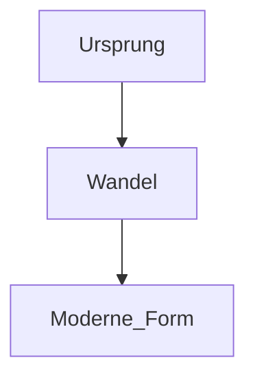

# CMS-Handbuch

Dieses Dokument ist die menschenlesbare Einfuehrung in das WorldMesh Worldbuilder CMS. Es richtet sich an Autorinnen und Autoren, Redakteurinnen und Redakteure, Maintainer und alle, die Inhalte, Strukturen oder Themes im System pflegen.

Fuer KI-spezifische Regeln gibt es zusaetzlich das hierarchische `AGENTS.md`-System. Dieses Handbuch erklaert dagegen das CMS selbst, die wichtigsten Arbeitsbereiche und die ueblichen Arbeitsablaeufe.

## 1. Was dieses CMS ist

Das WorldMesh Worldbuilder CMS ist ein dateibasiertes System fuer Wissensarchive, Worldbuilding und strukturierte Inhalte.

Wichtige Eigenschaften:

- Inhalte liegen direkt im Dateisystem
- Metadaten werden ueber Frontmatter gepflegt
- mehrere Themes werden serverseitig gerendert
- Mehrsprachigkeit laeuft ueber getrennte Locale-Roots
- Uebersetzungen werden ueber `translation_key` zugeordnet
- Typen, Felder und Relationen werden ueber Schema-Dateien gesteuert
- globale und eingebettete Graphen basieren auf Cytoscape

Es gibt bewusst keine Datenbank als primaere Inhaltsquelle. Die Dateien im Repository sind die Quelle der Wahrheit.

## 2. Wo welche Arbeit hingehoert

Die wichtigste Regel lautet: nach Aufgabe einsortieren, nicht nach Dateiendung.

`content/`
: normale Inhaltsseiten, Bereichs-Uebersichten und lokalisierte Content-Baeume

`cms/pages/`
: Standalone-Seiten wie Startseite, Impressum, Datenschutz oder andere explizit konfigurierte Seiten

`config/schema/`
: Typen, Felder und Relationen fuer strukturierte Inhalte

`themes/`
: Seitenshell, Theme-Layouts, Komponenten und theme-spezifische Assets

`cms/type-templates/`
: inhaltliche Darstellung typisierter Dokumente innerhalb der vorhandenen Theme-Shell

`docs/`
: Handbuecher, Architekturhinweise, Rezepte und Referenzen

Wenn eine Aenderung mehrere Bereiche betrifft, ist diese Reihenfolge meist sinnvoll:

1. Datenmodell oder Konfiguration festlegen
2. Rendering oder Template-Schicht anpassen
3. Inhalte erstellen oder migrieren
4. Validierung laufen lassen

## 3. Inhalte in `content/` pflegen

`content/` ist der normale Inhaltsbaum des CMS. Hier liegen Uebersichtsseiten, Fachseiten, Glossar-Eintraege, Weltbau-Kapitel und aehnliche Inhalte.

### Bereichs-Uebersichten

Ein Verzeichnis bekommt seine Einstiegsseite ueber eine Uebersichtsdatei, zum Beispiel:

- `00_Uebersicht.md`
- `00_Overview.md`

Diese Seite sollte:

- den Bereich kurz erklaeren
- wichtige Unterseiten verlinken
- Orientierung geben, statt bereits alle Details zu enthalten

### Fach- und Detailseiten

Normale Inhaltsseiten beschreiben ein konkretes Thema. Gute Seiten sind klar gegliedert, arbeiten mit Ueberschriften und enthalten sinnvolle interne Verlinkungen.

Typisches Frontmatter:

```yaml
---
title: Lysari
translation_key: demo.archive.species.lysari
type: species
relations:
  - type: originates_from
    target: Astraea
---
```

Wichtige Felder:

- `title`: wenn der Dateiname nicht als Lesetitel reicht
- `translation_key`: fuer sprachuebergreifende Zuordnung
- `type`: wenn die Seite schema-getrieben dargestellt werden soll
- `relations`: fuer explizite strukturierte Beziehungen

## 4. Mehrsprachigkeit richtig nutzen

Mehrsprachigkeit ist locale-aware und basiert auf getrennten Content-Roots pro Sprache. Fuer neue Instanzen liefert das Repo [site.config.sample.php](/site.config.sample.php); die lokale Runtime-Datei liegt danach unter `site.config.php`.

Beispiel:

```php
'i18n' => array(
    'defaultLocale' => 'de',
    'locales' => array(
        'de' => array(
            'content' => array('root' => 'content/de'),
        ),
        'en' => array(
            'content' => array('root' => 'content/en'),
        ),
    ),
),
```

Wichtige Regeln:

- Jede Sprache hat ihren eigenen Root.
- Ordner- und Dateinamen duerfen pro Sprache unterschiedlich sein.
- Uebersetzungen werden nicht ueber den Pfad erkannt.
- Die stabile Verbindung zwischen Sprachvarianten ist `translation_key`.
- Seiten ohne `translation_key` bleiben absichtlich nur in ihrer jeweiligen Sprache vorhanden.

Beispiel fuer lokalisierte Ordner:

```text
content/de/01_Demo-Archiv/00_Uebersicht.md
content/en/01_Demo-Archive/00_Overview.md
```

Wenn beide Seiten denselben Bereich beschreiben, brauchen sie denselben `translation_key`.

### Unterschied zwischen `translation_key` und `translationKey`

- `translation_key` wird im Markdown-Frontmatter normaler Inhalte verwendet.
- `translationKey` wird in `site.config.php` fuer konfigurierte Seiten wie Home oder Standalone-Pages verwendet.

### Fallback verstehen

Das CMS faellt nicht beliebig von einem unbekannten Pfad auf die Standardsprache zurueck. Fallback greift nur dann, wenn die Uebersetzungsgruppe bereits ueber ihren Key bekannt ist, zum Beispiel beim Sprachwechsel oder bei verlinkten Inhalten.

## 5. Standalone-Seiten in `cms/pages/`

Nicht jede Seite gehoert in den normalen Inhaltsbaum. `cms/pages/` ist fuer Seiten gedacht, die explizit ueber die Konfiguration eingebunden werden.

Typische Beispiele:

- Impressum
- Datenschutz
- Home-Seiten-Inhalte
- Instanzspezifische Service-Seiten

Wichtig:

- Eine Datei in `cms/pages/` allein macht die Seite noch nicht erreichbar.
- Die Seite muss zusaetzlich in der lokalen `site.config.php` eingetragen werden.
- Slug, Position in Footer oder Sidebar und sprachspezifische Varianten kommen aus der Konfiguration, nicht aus der Ordnerstruktur.

## 6. Markdown-Dialekt und Erweiterungen

Das CMS unterstuetzt mehr als Standard-Markdown. Fuer die exakte Syntax gibt es die Referenz in [docs/markdown-extensions-reference.md](/docs/markdown-extensions-reference.md). Die wichtigsten Regeln sind:

### Interne Links

Interne Links sollten moeglichst relativ geschrieben werden:

```md
[Archivuebersicht](../00_Uebersicht.md)
[Lysari](./01_Species_Lysari.md)
```

Nicht empfohlen sind hart gebaute Runtime-URLs wie `/<locale>/?page=...`, wenn ein relativer Link ausreicht.

### Wiki-Links und Embeds

Unterstuetzt werden auch Wiki-Formen:

```md
[[../00_Uebersicht.md|Archivuebersicht]]
![[../99_Medien/01_Illustrationen/demo-orbit-map.svg|caption=Orbitkarte|large|right|popover]]
```

### Icons

Icons werden ueber `icon:`-Ziele eingebunden:

```md

![[icon:status/relay|icon-inline|width=1.25rem]]
```

### Mermaid

Mermaid eignet sich fuer erklaerende, statische Diagramme:

````md

````

### Cytoscape `::graph`

`::graph` eignet sich fuer Relations- und Wissensgraphen:

```md
::graph
title: Demo-Archiv
from: star-archive
depth: 2
layout: cose
::
```

Faustregel:

- Mermaid fuer selbst geschriebene Diagramme
- `::graph` fuer CMS-nahe Beziehungsgraphen

## 7. Typen, Felder und Relationen

Strukturierte Inhalte werden ueber das Schema in `config/schema/` modelliert.

Wichtige Dateien:

- [config/schema/types.yaml](/config/schema/types.yaml)
- [config/schema/relations.yaml](/config/schema/relations.yaml)

Wann ein eigener Typ sinnvoll ist:

- wenn mehrere Seiten dieselbe wiederkehrende Feldstruktur brauchen
- wenn bestimmte Informationen nicht nur als Freitext vorkommen sollen
- wenn ein eigener Darstellungsmodus fuer diese Inhalte sinnvoll ist

Wann eine Relation sinnvoll ist:

- wenn die Beziehung eine klare Semantik hat
- wenn sie fuer Graphen, Panels oder strukturierte Abfragen hilfreich ist
- wenn sie ueber einzelne Einzelseiten hinaus wiederverwendet wird

Nicht jede neue Idee braucht sofort einen neuen Typ. Oft reicht zunaechst gute Prosa plus explizite `relations` im Frontmatter.

## 8. Type Templates

Type Templates in `cms/type-templates/` rendern den Inhalt typisierter Seiten. Sie sind nicht fuer Header, Sidebar oder Footer zustaendig.

Merksatz:

- Theme = aeussere Seitenshell
- Type Template = inhaltlicher Body einer typisierten Seite

Neue Type Templates sind sinnvoll, wenn die Darstellung einer Datenstruktur wirklich anders organisiert sein muss, nicht nur weil ein Feld an anderer Stelle stehen soll.

## 9. Themes, Templates und Assets

Jedes Theme hat seinen eigenen Ordner unter `themes/`.

Bevorzugte Struktur:

```text
themes/<theme>/
  templates/
    layout.tpl
    page.tpl
    components/
  assets/
    theme.css
    optional-js
    images/
```

Grundregeln:

- Theme-spezifische Templates bleiben im jeweiligen Theme-Ordner.
- Theme-spezifische CSS-, JS- und Bilddateien bleiben in `themes/<theme>/assets/`.
- `themes/shared/templates/` ist nur fuer wirklich gemeinsam genutzte Bausteine gedacht.
- Neue Layouts sollten in Komponenten zerlegt werden, statt grosse All-in-One-Dateien zu erzeugen.

## 10. Validierung und Release-Checks

Nach inhaltlichen Aenderungen:

```bash
php scripts/validate-content.php
```

Nach Aenderungen an Themes, Templates, i18n, Graphen, Schema oder Runtime:

```bash
php scripts/release-check.php --strict
```

Nuetzliche Befehle:

```bash
php scripts/smoke-test.php
php scripts/release-check.php
php scripts/release-check.php --strict
```

## 11. Weiterfuehrende Dokumentation

- [README.md](/README.md): Projektueberblick und Schnellstart
- [docs/markdown-extensions-reference.md](/docs/markdown-extensions-reference.md): exakte Markdown-Syntax
- [docs/release-checks.md](/docs/release-checks.md): Release- und Smoke-Checks
- [docs/public-repo-workflow.md](/docs/public-repo-workflow.md): oeffentlicher Demo-Stand vs. lokaler Privatbestand
- [docs/v1.0-upgrade.md](/docs/v1.0-upgrade.md): Einordnung der v1.0-Aenderungen
- [docs/knowledge-system-architecture.md](/docs/knowledge-system-architecture.md): Architektur und Wissensmodell
