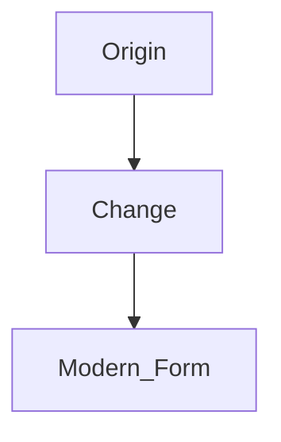

# CMS Handbook

This document is the human-facing introduction to the Enari Markdown CMS. It is written for authors, editors, maintainers, and anyone who needs to work with content, structure, or themes in the system.

There is also a separate hierarchical `AGENTS.md` system for AI-specific authoring guidance. This handbook explains the CMS itself, the main work areas, and the usual workflows for people.

## 1. What This CMS Is

The Enari Markdown CMS is a file-based system for knowledge archives, worldbuilding, and structured content.

Core characteristics:

- content lives directly in the filesystem
- metadata is stored in frontmatter
- multiple themes are rendered server-side
- multilingual content uses separate locale roots
- translations are matched through `translation_key`
- types, fields, and relations are modeled through schema files
- global and embedded graphs are rendered with Cytoscape

There is intentionally no database as the primary content source. The repository files are the source of truth.

## 2. Where Work Belongs

The most important rule is to organize work by purpose, not by file extension.

`content/`
: normal archive pages, directory overviews, and localized content trees

`cms/pages/`
: standalone pages such as the home page, imprint, privacy policy, or other explicitly configured pages

`config/schema/`
: types, fields, and relations for structured content

`themes/`
: page shell, theme layouts, components, and theme-specific assets

`cms/type-templates/`
: body rendering for typed documents inside the existing theme shell

`docs/`
: handbooks, architecture notes, recipes, and references

If a change spans multiple areas, this order is usually the safest:

1. define the model or configuration
2. adapt rendering or templates
3. create or migrate content
4. run validation

## 3. Working With `content/`

`content/` is the normal content tree of the CMS. This is where overview pages, knowledge pages, glossary entries, worldbuilding chapters, and similar archive content belong.

### Directory Overview Pages

A directory gets its landing page through an overview file such as:

- `00_Uebersicht.md`
- `00_Overview.md`

That page should:

- explain the area briefly
- link to important child pages
- provide orientation instead of trying to contain every detail

### Topic and Detail Pages

Regular content pages describe one specific topic. Good pages use clear headings, meaningful internal links, and a structure that stays easy to scan.

Typical frontmatter:

```yaml
---
title: Veyrathi
translation_key: worldbuilding.languages.veyrathi
type: language
relations:
  - type: derived_from
    target: Proto-Veyatish
---
```

Important fields:

- `title`: when the filename is not a good display title
- `translation_key`: for cross-locale identity
- `type`: when the page should use schema-driven rendering
- `relations`: for explicit structured relationships

## 4. Using Multilingual Content Correctly

Multilingual support in v1.0 is locale-aware and based on separate content roots per language. The configuration lives in [cms/site.config.php](/cms/site.config.php).

Example:

```php
'i18n' => array(
    'defaultLocale' => 'de',
    'locales' => array(
        'de' => array(
            'content' => array('root' => 'content/de'),
        ),
        'en' => array(
            'content' => array('root' => 'content/en'),
        ),
    ),
),
```

Important rules:

- Each language has its own root.
- Folder and file names may differ between locales.
- Translations are not matched by path.
- The stable identity between language variants is `translation_key`.
- Pages without `translation_key` stay intentionally local to their own locale.

Example with localized folders:

```text
content/de/01_Weltbau/01_Sprachen/00_Uebersicht.md
content/en/01_Worldbuilding/01_Languages/00_Overview.md
```

If both pages describe the same concept, they must share the same `translation_key`.

### `translation_key` vs `translationKey`

- `translation_key` is used in Markdown frontmatter for normal content.
- `translationKey` is used in `cms/site.config.php` for configured pages such as the home page or standalone pages.

### Understanding Fallback

The CMS does not silently map any unknown localized path to the default language. Fallback only applies when the translation group is already known, for example through the language switcher or a link tied to a known translation key.

## 5. Standalone Pages in `cms/pages/`

Not every page belongs in the normal archive tree. `cms/pages/` is for pages that are explicitly wired through configuration.

Typical examples:

- imprint / legal notice
- privacy policy
- home page content
- instance-specific service pages

Important:

- A file inside `cms/pages/` is not enough on its own.
- The page also has to be registered in [cms/site.config.php](/cms/site.config.php).
- The slug, footer/sidebar placement, and locale-specific variants come from configuration, not from folder structure.

## 6. Markdown Dialect and Extensions

The CMS supports more than plain Markdown. For exact syntax, use [docs/markdown-extensions-reference.md](/docs/markdown-extensions-reference.md). The most important rules are:

### Internal Links

Internal links should usually be written as relative links:

```md
[Languages](../01_Languages/00_Overview.md)
[Phonology](./01_Phonology.md)
```

Hand-built runtime URLs such as `/<locale>/?page=...` should be avoided when a relative link is sufficient.

### Wiki Links and Embeds

Wiki-style forms are also supported:

```md
[[../01_Languages/00_Overview.md|Languages]]
![[../99_Media/map.png|caption=Regional map|large|right|popover]]
```

### Icons

Icons are embedded through `icon:` targets:

```md

![[icon:status/relay|icon-inline|width=1.25rem]]
```

### Mermaid

Mermaid is best for authored, static diagrams:

````md

````

### Cytoscape `::graph`

`::graph` is best for relationship and knowledge graphs:

```md
::graph
title: Language Family
from: veyrathi
depth: 2
layout: cose
::
```

Rule of thumb:

- use Mermaid for hand-authored explanatory diagrams
- use `::graph` for CMS-native relationship graphs

## 7. Types, Fields, and Relations

Structured content is modeled through the schema in `config/schema/`.

Key files:

- [config/schema/types.yaml](/config/schema/types.yaml)
- [config/schema/relations.yaml](/config/schema/relations.yaml)

When a dedicated type makes sense:

- when multiple pages need the same repeated field structure
- when specific data should not live only in free prose
- when a dedicated rendering mode for that content is useful

When a relation makes sense:

- when the relationship has clear semantics
- when it helps graphs, panels, or structured queries
- when it will be reused beyond a single isolated page

Not every new idea needs a new type immediately. In many cases, good prose plus explicit `relations` in frontmatter is enough at first.

## 8. Type Templates

Type templates in `cms/type-templates/` render the body of typed pages. They are not responsible for the page header, sidebar, or footer.

Simple rule:

- Theme = outer page shell
- Type template = content body of a typed page

New type templates make sense when a structured content model really needs a different body composition, not just because one field should appear slightly higher or lower.

## 9. Themes, Templates, and Assets

Each theme has its own folder under `themes/`.

Preferred structure:

```text
themes/<theme>/
  templates/
    layout.tpl
    page.tpl
    components/
  assets/
    theme.css
    optional-js
    images/
```

Core rules:

- Theme-specific templates stay inside the theme folder.
- Theme-specific CSS, JS, and images stay in `themes/<theme>/assets/`.
- `themes/shared/templates/` is only for genuinely shared building blocks.
- New layouts should be split into components instead of growing into large all-in-one templates.

## 10. Validation and Release Checks

After content changes:

```bash
php scripts/validate-content.php
```

After changes to themes, templates, i18n, graphs, schema, or runtime behavior:

```bash
php scripts/release-check.php --strict
```

Useful commands:

```bash
php scripts/smoke-test.php
php scripts/release-check.php
php scripts/release-check.php --strict
```

## 11. Additional Documentation

- [README.md](/README.md): project overview and quick start
- [docs/markdown-extensions-reference.md](/docs/markdown-extensions-reference.md): exact Markdown syntax
- [docs/release-checks.md](/docs/release-checks.md): release and smoke checks
- [docs/v1.0-upgrade.md](/docs/v1.0-upgrade.md): context for the v1.0 changes
- [docs/knowledge-system-architecture.md](/docs/knowledge-system-architecture.md): architecture and knowledge model

