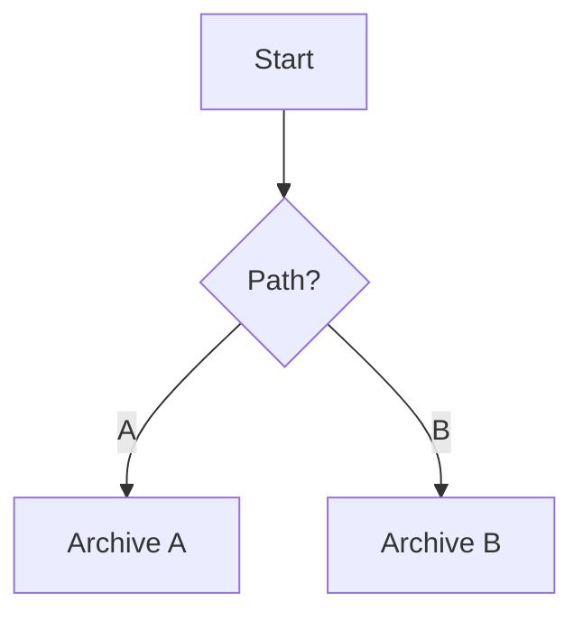
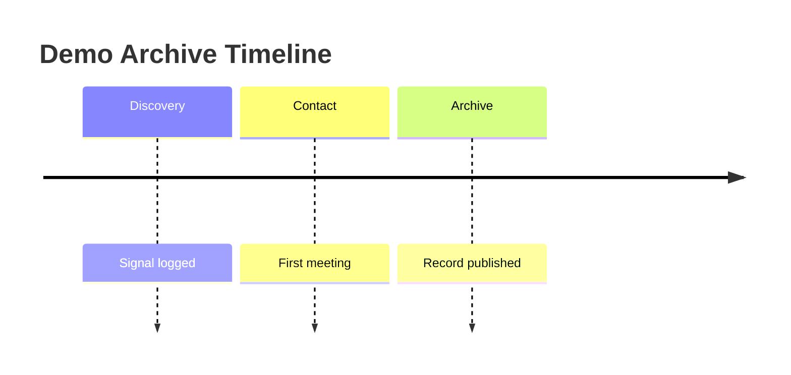

# Markdown Extensions Reference

This document defines the current CMS Markdown dialect for AI-assisted authoring. It documents only syntax that is supported by the current renderer.

Use this file together with `content/AGENTS.md`.

## 1. Relative Markdown Links

Prefer relative links inside the content tree.

Examples:

```md
[Archive overview](../00_Uebersicht.md)
[Lysari](./01_Species_Lysari.md)
```

Rules:

- prefer relative links over hand-built runtime URLs
- link to the local locale tree whenever possible
- keep links readable and stable for content authors

## 2. Wiki-Style Links and Media Embeds

Wiki-style links are supported:

```md
[[../00_Uebersicht.md|Archive overview]]
```

Wiki-style media embeds are also supported:

```md
![[../99_Medien/01_Illustrationen/demo-orbit-map.svg|Orbit map]]
![[../99_Medien/reference-sheet.pdf|Reference document]]
![[../99_Medien/audio-sample.mp3|Pronunciation sample]]
```

Supported media option tokens can be combined with captions:

```md
![[../99_Medien/01_Illustrationen/demo-orbit-map.svg|caption=Orbit map|large|right|popover]]
![[../99_Medien/portrait.png|Portrait|small|left]]
![[../99_Medien/map.png|width=26rem|align=center]]
```

Supported options:

- sizes: `small`, `medium`, `large`, `full`
- alignment: `left`, `center`, `right`
- booleans: `popover`, `zoom`, `lightbox`, `no-popover`
- keyed options: `caption=`, `alt=`, `width=`, `align=`, `color=`

## 3. Icon Embeds

Icons are addressed through `icon:` targets.

Normal Markdown form:

```md

|width=1.25rem")
```

Wiki-style form:

```md
![[icon:status/relay]]
![[icon:status/relay|icon-inline|icon-padding|width=1.75rem]]
![[icon:status/relay|caption=Relay status|icon]]
```

Recommended uses:

- `icon-inline` for icons inside running text
- `icon` for block-like icon presentation
- `icon-padding` when the icon needs visual breathing room
- `color=` when the icon should be tinted explicitly

Do not use icon embeds as a substitute for general illustrations or screenshots.

## 4. Mermaid Blocks

Use Mermaid for static, authored diagrams.

Valid fenced block languages:

- `mermaid`
- `mmd`

Example 1:

````md

````

Example 2:

````md
```mmd
sequenceDiagram
    participant Author
    participant CMS
    Author->>CMS: Add Markdown page
    CMS-->>Author: Render preview
```
````

Example 3:

````md

````

Use Mermaid when the diagram is authored directly and does not need CMS graph semantics.

## 5. WorldOrbit Blocks

Use `worldorbit` fenced blocks for interactive atlas views such as star systems, orbital layouts, and spatial worldbuilding scenes.

Example with explicit CMS bindings:

````md
```worldorbit
schema 2.5

#cms-bind object=naar page=./01_Planet_Naar.md
#cms-bind object=relay-station page=demo.archive.relay-station

system enari
    title "Enari System"

star enari-prime
planet naar orbit enari-prime distance 1 au
station relay-station at naar label "Relay"
```
````

Binding rules:

- use `#cms-bind object=<worldorbit-id> page=<cms-target>` inside the fenced block
- `page=` uses the CMS link resolver, so relative paths, slugs, content references, and `translation_key` targets are allowed
- bindings are always explicit; the CMS does not guess links from object names
- keep the comment lines in the block, because WorldOrbit ignores them and the CMS reads them as metadata

Use WorldOrbit when the content should stay atlas-like and spatial, not when a normal flowchart or relation graph is enough.

## 6. Cytoscape `::graph` Blocks

Use `::graph` blocks for CMS-native graph rendering.

Minimal graph:

```md
::graph
title: Star Archive Network
from: star-archive
depth: 2
layout: cose
::
```

Graph with filters and layout:

```md
::graph
title: Demo Archive Relations
from: star-archive
depth: 2
layout: breadthfirst
filterTypes: species,institution
highlight: lysari
::
```

Graph with manual nodes and edges:

```md
::graph
title: Mixed Example
layout: concentric

nodes:
  - id: custom-note
    label: Special Case
    type: note

edges:
  - source: star-archive
    target: custom-note
    label: Documents
::
```

Common top-level keys used by the renderer:

- `title`
- `caption`
- `summary`
- `from`
- `depth`
- `layout`
- `filterTypes`
- `highlight`
- `nodes`
- `edges`

Use Cytoscape when the graph should reflect CMS relations, navigation context, or mixed manual/CMS graph data.

## 7. Image Map `::map` Blocks

Use `::map` blocks for image-based maps with clickable pins and layer toggles.

Minimal map:

```md
::map
asset: ./99_Medien/01_Illustrationen/demo-archive-station.svg
title: Demo Archive Station
::
```

Map with caption, height, and visible layers:

```md
::map
asset: ./99_Medien/01_Illustrationen/demo-archive-station.svg
title: Demo Archive Station
caption: Clickable pins are loaded from the image sidecar manifest.
height: 34rem
layers: default,notes
::
```

Renderer keys:

- `asset`
- `title`
- `caption`
- `height`
- `layers`

Behavior rules:

- the block references an image asset; the pin and layer data live in a sidecar file named `<asset>.map.yaml`
- create and edit the sidecar through the Media workspace `Map pins` editor
- pin targets may point to CMS pages, media assets, or external URLs
- CMS targets use the same resolver rules as WorldOrbit bindings, so relative paths, slugs, content references, and `translation_key` targets are allowed
- the frontend only loads the map viewer on pages that actually contain a `::map` block

Use `::map` when the primary artifact is an image map or region map. Use WorldOrbit for atlas-like system diagrams and `::graph` for relation graphs.

## 8. Common Mistakes

- Do not hardcode `/<locale>/?page=...` inside content when a relative link works.
- Do not use raw HTML for images or icons when normal Markdown or wiki-style embeds already support the case.
- Do not use Cytoscape `::graph` blocks for simple explanatory flowcharts that Mermaid handles better.
- Do not use WorldOrbit bindings without `object=` and `page=`; incomplete `#cms-bind` comments are treated as warnings.
- Do not rely on object-name guessing for CMS links inside WorldOrbit blocks.
- Do not omit the closing `::` in a graph or map block.
- Do not invent unsupported option names or undocumented graph block syntax.
